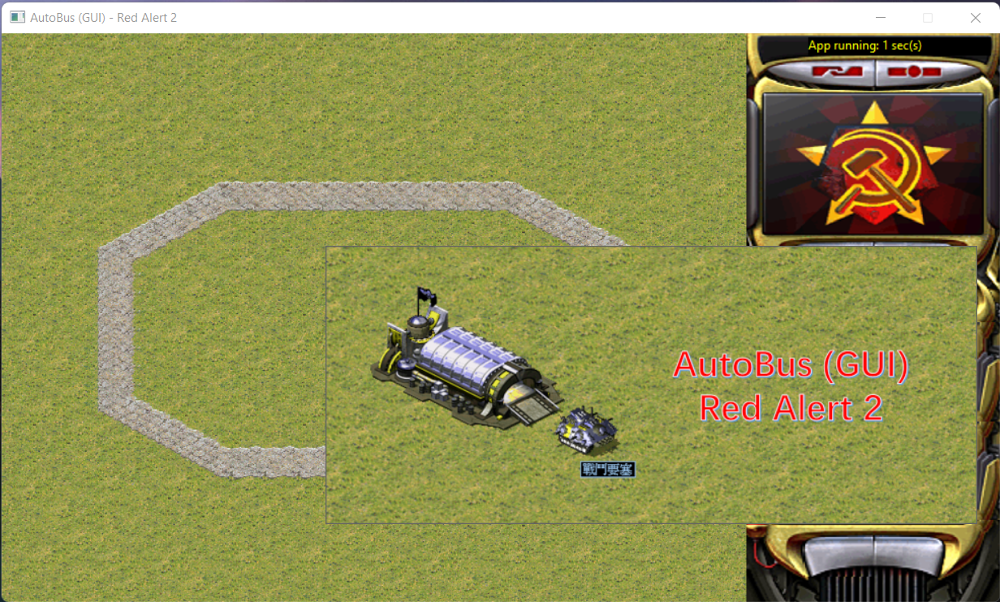
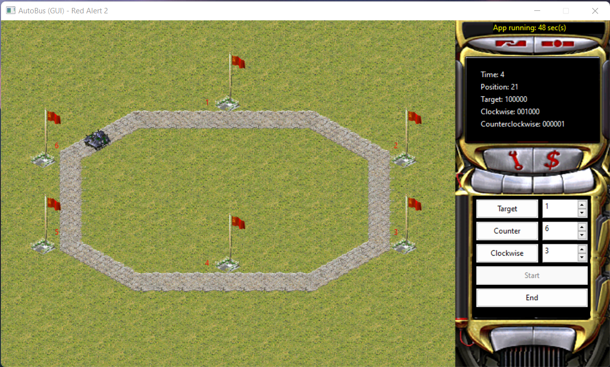

# AutoBus - 图形化自动公交调度系统

## 简介
北京邮电大学 2022 年 计算导论与程序设计课程实践 作业

为了纪念 红色警戒 2 这一款经典游戏，我们大量使用了 RA2 的素材。

- GUI 框架: `wxWidgets`
- 操作系统: `Windows`, 理论上 `*nix` 也受支持，但是未经测试

## 使用方法
- 点击 `Start` 选择配置文件以决定站点数、两站间距和调度策略 (FCFS 先到先得、SCAN 扫描算法、SSTF 顺便服务)。我们提供了一个样例的 `dict.dic` 配置文件。
- 通过 `Target`、`Counter` 和 `Clockwise` 以及后面的数字框 来分别设置 车内请求和两个方向的站台请求。

## 构建方法
### Windows
- 通过 [`Download Windows Binaries`](https://www.wxwidgets.org/downloads/) 来配置 `wxWidgets`. 需要将 `Header Files` 和 `Development Files` 放置在 `C:\Develop\wxWidgets-3.2.1` 目录下
- `Visual Studio` 中，对 `Debug` 和 `Release` 导入  `C:\Develop\wxWidgets-3.2.1\wxwidgets.props` 配置文件
- 构建

请注意，运行需要保证 `wxWidgets` 运行库和 `Assets` 文件夹与 可执行文件在同一目录下。

### *nix
请参考各平台配置和编译 `wxWidgets` 的方法，我没有自己测试过。

## 截图



## 授权
```
Copyright © 2022 雷瑞祺 mail@rn7s2.cn
This work is free. You can redistribute it and/or modify it under the
terms of the Do What The Fuck You Want To Public License, Version 2,
as published by Sam Hocevar. See the COPYING file for more details.
```
